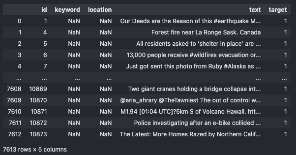
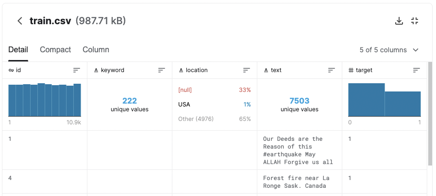

# kaggle-nlp-disasters
https://www.kaggle.com/c/nlp-getting-started

You can imagine how an NLP classifier would
mistakenly label this tweet as one referring to a real 
emergency, since it uses the word _ablaze_.

## Competition Description
Agencies and organizations will mine twitter,
sometimes for emergency response.

The Kaggle challenge is as follows:
>Train an NLP classifier that can do well-enough at detecting real emergencies from a set of tweets.

## Data
* `sample_submission.csv`: Used for formatting your output in a way that Kaggle can score you
* `train.csv`: Data you will use for training and validation
* `test.csv`: Hold-out set

Here is an example of training data:

